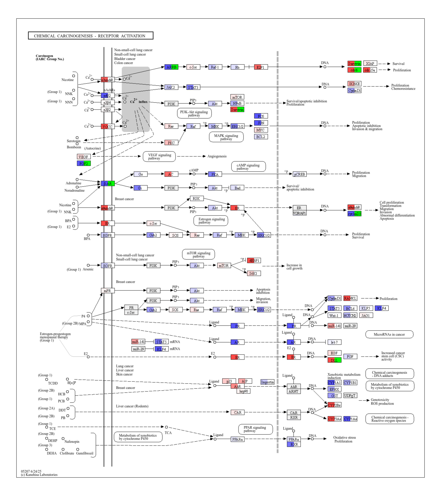
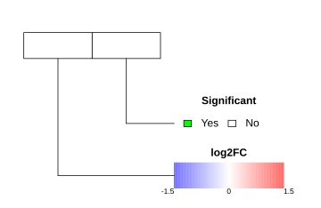
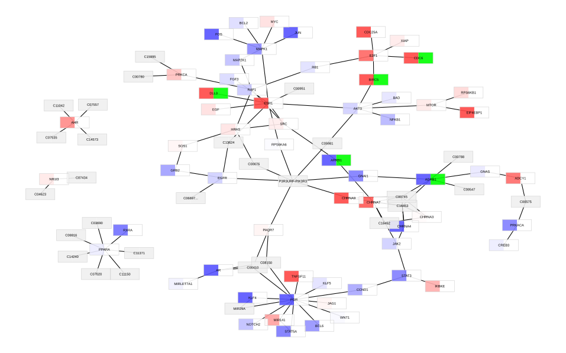

```{r setup, echo=FALSE, results="hide"}
knitr::opts_chunk$set(
    tidy = FALSE,
    cache = FALSE,
    dev = "png",
    message = FALSE, error = FALSE, warning = TRUE)
```

This vignette will cover visualizing differential expression analysis results 
onto *KEGG* pathway diagrams.

# Getting started
First, make sure you install and load all necessary packages.
```{r installation, message = FALSE, warning = FALSE}
library(PinPath)
library(org.Hs.eg.db)
```

# Dataset
The example dataset we will use compares the expression of transcripts in 
lung cancer biopsies versus normal tissue. Differential expression analysis 
has already been performed, generating log2FCs and p-values for each gene. 
```{r dataset, message = FALSE, warning = FALSE}
lung_expr <- read.csv(
    system.file("extdata","data-lung-cancer.csv", package ="PinPath"), 
    stringsAsFactors = FALSE)
```

In the pathway, we want to show which gene is significantly differentially 
expressed. For this, we will use an adjusted p-value cutoff of 0.05.
```{r significance, results = 'asis'}
lung_expr$Significant <- ifelse(lung_expr$adj.P.Value < 0.05, "Yes", "No")
```

# Set colors
After we have loaded and prepared the differential expression analysis 
statistics, we need to define how to color the statistics in the pathway 
diagram. In this vignette, we will plot the log2FC and significance of each 
gene on the pathway diagram. We can start by loading the default color palette.
```{r default-color-values}
colorList <- PinPath::defaultColorList(lung_expr[,c("log2FC", "Significant")])
```

In the next step, we can adjust the default color palette to the desired color 
values. For instance, we want to display a green color when a gene is 
differentially expressed  and a white color when it is not.
```{r modify-significant-color}
colorList[["Significant"]]$Color <- c(
    "Yes" = "green",
    "No" = "white")
```

Furthermore, we can set the minimum and maximum value  of the log2FC color
gradient to -1.5 and 1.5, respectively.
```{r modify-log2FC-color}
colorList[["log2FC"]]$ColorVal <- c(
    "MinVal" = -1.5,
    "MidVal" = 0,
    "MaxVal" = 1.5)
```

# Plot pathway
We can now plot the differential expression statistics on the 
*hsa05207: Chemical carcinogenesis - receptor activation* pathway.
If not specified otherwise, the pathway and legend image will be saved in 
your working directory. The pathway image will be opened by default.
```{r plot-pathway, message = FALSE, warning = FALSE}
# Select pathway
pathway_id <- "hsa05207"
infile <- BiocFileCache::bfcrpath(
    BiocFileCache::BiocFileCache(),
    paste0("https://rest.kegg.jp/get/",pathway_id,"/kgml"))

# Plot pathway
pathVis <- PinPath::drawKGML(
    infile = infile,
    annGenes = "org.Hs.eg.db",
    inputDB = "ENSEMBL",
    featureIDs = lung_expr$GeneID,
    colorVar = lung_expr[,c("log2FC", "Significant")],
    colorList = colorList,
    nodeTable = TRUE,
    legend = TRUE,
    openFile = FALSE) # <-- set to TRUE to open the image automatically
```

Pathway image:


Legend image:


# Plot network
You can also plot the pathway as a network. In contrast to the pathway diagram, 
every element (e.g., gene/protein) is represented exactly once in the network.
```{r plot-network, message = FALSE, warning = FALSE}
pathVis <- PinPath::KGML2Network(
    infile = infile,
    annGenes = "org.Hs.eg.db",
    inputDB = "ENSEMBL",
    featureIDs = lung_expr$GeneID,
    colorVar = lung_expr[,c("log2FC", "Significant")],
    colorList = colorList,
    nodeTable = TRUE,
    legend = FALSE,
    openFile = FALSE) # <-- set to TRUE to open the image automatically
```

Network image:


Legend image:


# Session info

```{r sessionInfo}
sessionInfo()
```

